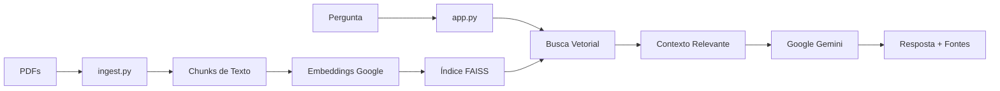

# 🔧 OFICINA-HELP

Sistema RAG (Retrieval-Augmented Generation) para consulta de manuais técnicos de veículos. Permite que mecânicos façam perguntas técnicas e recebam respostas baseadas exclusivamente nos manuais em PDF fornecidos.

## 📋 Sumário

- [Visão Geral](#-visão-geral)
- [Tecnologias](#-tecnologias)
- [Estrutura do Projeto](#-estrutura-do-projeto)
- [Instalação](#-instalação)
- [Configuração](#-configuração)
- [Uso](#-uso)
- [Funcionamento](#-funcionamento)

## 🎯 Visão Geral

O OFICINA-HELP é um assistente inteligente que:

- ✅ Responde perguntas técnicas com base nos manuais oficiais
- ✅ Separa os índices por marca (Jeep, Audi, Porsche)
- ✅ Cita a fonte (arquivo e página) em cada resposta
- ✅ Interface web amigável com Streamlit
- ✅ Utiliza IA Generativa do Google (Gemini 1.5 Flash)

## 🛠 Tecnologias

| Componente | Tecnologia |
|------------|------------|
| Linguagem | Python 3.10+ |
| Interface | Streamlit |
| LLM | Google Gemini 1.5 Flash |
| Embeddings | Google Embedding-001 |
| Vector Store | FAISS (CPU) |
| Framework | LangChain |

## 📁 Estrutura do Projeto

```
OFICINA-HELP/
├── data/
│   ├── jeep/           # PDFs da Jeep
│   ├── audi/           # PDFs da Audi
│   └── porsche/        # PDFs da Porsche
├── vectorstore/        # Índices FAISS (gerados automaticamente)
├── app.py              # Aplicação Streamlit
├── ingest.py           # Script de processamento de PDFs
├── requirements.txt    # Dependências Python
├── .env                # Chave de API (criar a partir de .env.example)
├── .env.example        # Template do arquivo .env
└── README.md           # Este arquivo
```

## 🚀 Instalação

### 1. Clone o repositório

```bash
git clone https://github.com/seu-usuario/OFICINA-HELP.git
cd OFICINA-HELP
```

### 2. Crie um ambiente virtual

```bash
# Windows
python -m venv venv
venv\Scripts\activate

# Linux/Mac
python3 -m venv venv
source venv/bin/activate
```

### 3. Instale as dependências

```bash
pip install -r requirements.txt
```

## ⚙️ Configuração

### 1. Obtenha a API Key do Google

1. Acesse [Google AI Studio](https://makersuite.google.com/app/apikey)
2. Crie uma nova API Key
3. Copie a chave gerada

### 2. Configure o arquivo .env

```bash
# Copie o template
cp .env.example .env

# Edite o arquivo .env e adicione sua chave
GOOGLE_API_KEY=sua_chave_api_aqui
```

### 3. Adicione os PDFs

Coloque os manuais em PDF nas pastas correspondentes:

```
data/
├── jeep/      ← Manuais da Jeep aqui
├── audi/      ← Manuais da Audi aqui
└── porsche/   ← Manuais da Porsche aqui
```

### 4. Processe os PDFs

```bash
python ingest.py
```

Este comando irá:

- Ler todos os PDFs de cada pasta
- Dividir o texto em chunks
- Criar embeddings usando Google AI
- Salvar índices FAISS separados por marca

## 📖 Uso

### Iniciar a aplicação

```bash
streamlit run app.py
```

A aplicação será aberta no navegador em `http://localhost:8501`

### Como usar

1. **Selecione a marca** na barra lateral (Jeep, Audi ou Porsche)
2. **Digite sua pergunta** no campo de texto
3. **Clique em "Buscar Resposta"**
4. **Visualize a resposta** e as fontes utilizadas

### Exemplos de perguntas

- "Qual é o torque de aperto das rodas?"
- "Como fazer a troca de óleo do motor?"
- "Qual o intervalo de manutenção do câmbio?"
- "Onde fica o filtro de ar do motor?"

## 🔄 Funcionamento



### Fluxo de Processamento

1. **Ingestão (ingest.py)**
   - Carrega PDFs por marca
   - Divide em chunks de 2000 caracteres
   - Gera embeddings com Google AI
   - Salva índices FAISS separados

2. **Consulta (app.py)**
   - Usuário seleciona a marca
   - Carrega apenas o índice correspondente
   - Busca os 4 chunks mais relevantes
   - Envia contexto + pergunta para o Gemini
   - Exibe resposta com citação das fontes

## ⚠️ Observações

- A IA responde **apenas** com base nos manuais fornecidos
- Se a informação não estiver nos PDFs, ela dirá "Não consta no manual"
- Mantenha a API Key segura e não a compartilhe
- Os índices FAISS são salvos localmente para reutilização

## 📝 Licença

Este projeto é para uso interno. Todos os manuais são de propriedade das respectivas montadoras.

---

**Desenvolvido com ❤️ para auxiliar mecânicos**

---
*Última sincronização testada: 2026-01-06 09:24*
